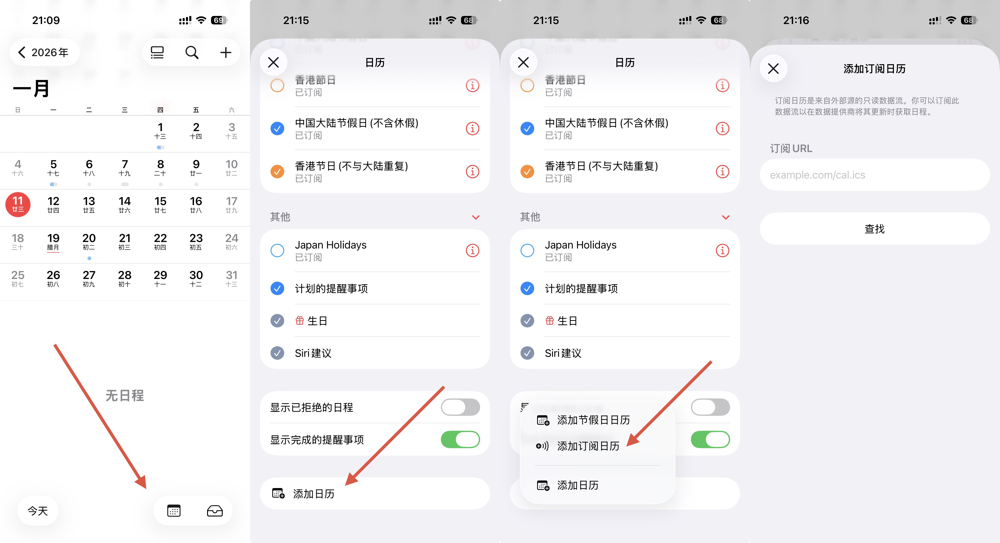
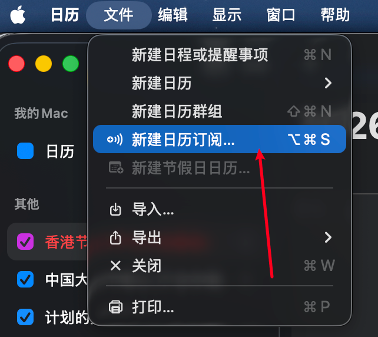

从安卓转到 iOS 之后发现，iOS 自带的日历应用用着非常不顺手。

对我来说，最大的痛点有 2 个，我的公司不调休放假，这导致订阅 `中国大陆节假日` 会多出一些不必要的假期信息，另外一个痛点是 `中国大陆节假日` 不带国际节假日信息。

于是我决定自己定制一个日历订阅，包含我需要的节假日信息。

## 实现原理

我并不打算从头做起，因此我写了一个简单的 web 服务端，基于 Apple 提供的节假日订阅数据：

- [中国大陆节假日](https://calendars.icloud.com/holidays/cn_zh.ics)
- [中国香港节假日](https://calendars.icloud.com/holidays/hk_zh.ics)

服务端在每次请求时，将获取原始信息，进行剔除，再返回文件给客户端。

代码编写完成后，最后使用 Vercel 部署了这个服务端。

## 可用订阅

中国大陆节假日日历，移除（休）（班）相关事件，仅保留纯节假日：

```text
https://calendar.edward-tech.com/ios/calendar/holidays-only.ics
```

香港独有节日日历，去除与大陆重复的节假日：

```text
https://calendar.edward-tech.com/ios/calendar/hk-unique.ics
```

直接访问 [calendar.edward-tech.com](https://calendar.edward-tech.com)，将返回：

```json
{
  "name": "iOS Calendar API",
  "endpoints": [
    {
      "url": "https://calendar.edward-tech.com/ios/calendar/holidays-only.ics",
      "description": "中国大陆节假日日历，移除（休）（班）相关事件，仅保留纯节假日"
    },
    {
      "url": "https://calendar.edward-tech.com/ios/calendar/hk-unique.ics",
      "description": "香港独有节日日历，去除与大陆重复的节假日"
    }
  ]
}
```

## 使用方法

iOS 打开日历，按如下步骤操作即可：



macOS 打开日历，按如下步骤操作即可：

{width="400"}