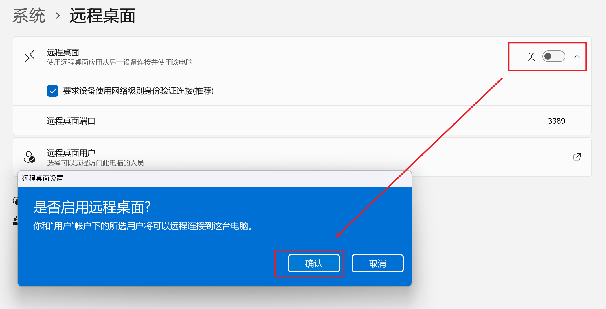
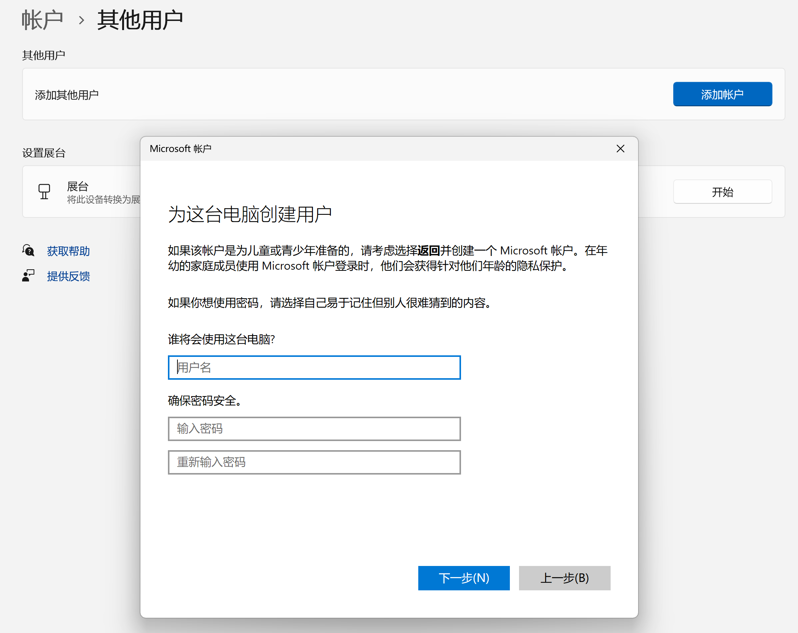

# Apache Guacamole

Apache Guacamole 是一个 HTML5 远程桌面网关，支持 VNC、RDP 和 SSH 协议。它可以让你通过浏览器访问远程服务器，而不需要安装客户端。

本文介绍如何在 Linux (基于 Docker) 上部署 guacamole，并通过 RDP 连接局域网内的 Windows 服务器。理论上也可以连接互联网上的 Windows 服务器，但是需要注意安全问题。

## 准备工作

1. 一台运行 Linux 的服务器，安装了 Docker 和 Docker Compose。
2. 一台 Windows 服务器，开启了 RDP 服务。

## 部署 Guacamole

1. 目录和文件准备。

- `guacamole`：guacamole 的工作和配置目录。
  - `init`：guacamole 数据库初始化脚本目录。
  - `data`：guacamole 数据库数据目录。
- 这里使用 docker run 命令生成 guacamole 数据库初始化脚本。

```bash
mkdir guacamole
cd guacamole
mkdir init
docker run --rm guacamole/guacamole /opt/guacamole/bin/initdb.sh --postgresql > init/initdb.sql
mkdir data
```

2. 创建 `docker-compose.yml` 文件。

- `guacd`：guacamole 的代理服务。不会被直接访问。
- `guacamole`：guacamole 的 Web 服务。需要被访问，这里映射到 11000 端口。
- `postgres`：guacamole 的数据库服务。不会被直接访问，密码随意设置。

```yaml
services:
  guacd:
    image: guacamole/guacd
    networks:
      - guacamole_net
    restart: always
  
  guacamole:
    image: guacamole/guacamole
    networks:
      - guacamole_net
    ports:
      - "11000:8080"
    environment:
      GUACD_HOSTNAME: guacd
      POSTGRES_HOSTNAME: postgres
      POSTGRES_DATABASE: guacamole_db
      POSTGRES_USER: guacamole_user
      POSTGRES_PASSWORD: choose_a_strong_password
    depends_on:
      - guacd
      - postgres
    restart: always
  
  postgres:
    image: postgres:13
    networks:
      - guacamole_net
    environment:
      POSTGRES_DB: guacamole_db
      POSTGRES_USER: guacamole_user
      POSTGRES_PASSWORD: choose_a_strong_password
    volumes:
      - ./init:/docker-entrypoint-initdb.d
      - ./data:/var/lib/postgresql/data
    restart: always

networks:
  guacamole_net:
    driver: bridge
```

3. 启动 guacamole。

```bash
docker-compose up -d
```

现在可以通过 `http://<server_ip>:11000/guacamole` 访问 guacamole 的 Web 页面。

## Windows 服务器配置

1. 打开 Windows 服务器的 RDP 服务，默认端口为 3389。



2. 创建一个本地用户，用于 RDP 登录。



3. 建议先通过 Windows 自带的远程桌面连接测试连接是否正常。

## Guacamole 配置

1. 登录 guacamole。

- 默认用户名和密码为 `guacadmin` 和 `guacadmin`。

2. 添加 Windows 服务器。

- 右上角点击用户名，选择 `设置`。
- 选择 `连接`，点击 `新建连接`。
- `编辑连接`，填写名称，位置默认即可，协议选择 `RDP`。
- `参数-网络`，主机名填写 Windows 服务器的 IP 地址，端口填写 3389。
- `参数-认证`，用户名和密码填写刚刚创建的本地用户，域填写 `MicrosoftAccount`，安全模式留空，勾选忽略服务器证书
- 保存

3. 连接 Windows 服务器。

- 返回首页，在`全部连接` 中点击刚刚创建的连接即可连接 Windows 服务器。

## 进阶配置

- 由于 guacamole 的 Web 页面是通过 HTTP 访问的，建议使用 Nginx 反向代理 guacamole，添加 HTTPS 支持。
- 这里配置了将 `/` 重定向到 `/guacamole`，避免直接访问的 404 错误。
- 反向代理的端口为 11000，需要与前面的 `docker-compose.yml` 文件中的端口映射一致。


```nginx
server {
    listen 443 ssl;
    server_name rdp.example.com;

    ssl_certificate /etc/nginx/ssl/rdp.example.com.fullchain.pem;
    ssl_certificate_key /etc/nginx/ssl/rdp.example.com.key.pem;

    ssl_protocols TLSv1.2 TLSv1.3;
    ssl_ciphers 'TLS_AES_128_GCM_SHA256:TLS_AES_256_GCM_SHA384:TLS_CHACHA20_POLY1305_SHA256:ECDHE-RSA-AES128-GCM-SHA256:ECDHE-RSA-AES256-GCM-SHA384';

    location = / {
        return 301 /guacamole;
    }

    location /guacamole {
        proxy_pass http://localhost:11000;

        proxy_set_header Host $host;
        proxy_set_header X-Real-IP $remote_addr;
        proxy_set_header X-Forwarded-For $proxy_add_x_forwarded_for;
        proxy_set_header X-Forwarded-Proto $scheme;
        proxy_set_header X-Forwarded-Host $host:$server_port;

        # WebSocket 支持
        proxy_http_version 1.1;
        proxy_set_header Upgrade $http_upgrade;
        proxy_set_header Connection "upgrade";
        proxy_buffering off;
        proxy_connect_timeout 7d;
        proxy_send_timeout 7d;
        proxy_read_timeout 86400s;
    }
}
```