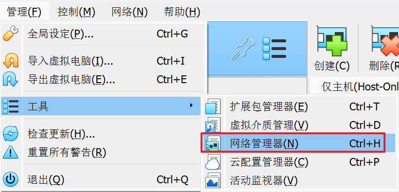
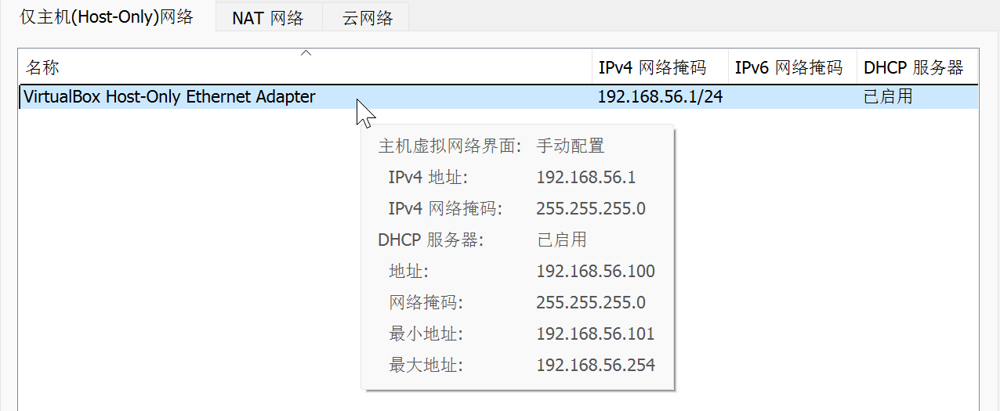
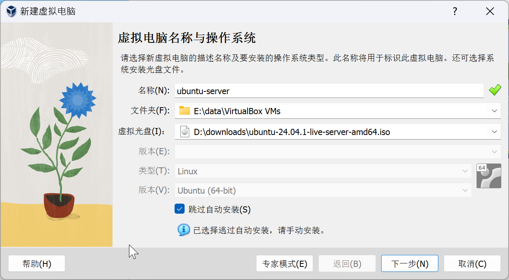
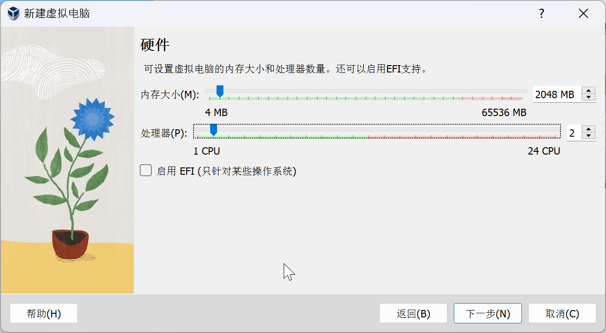
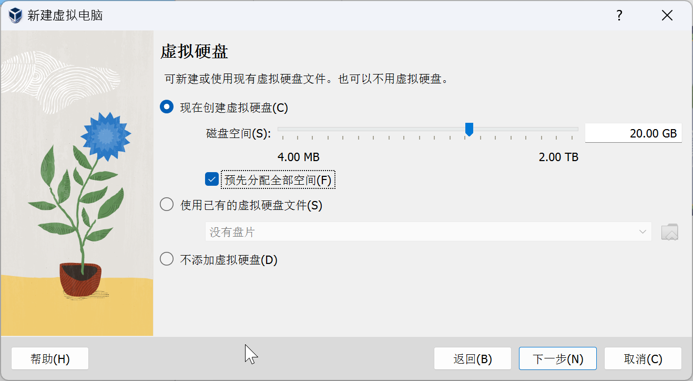
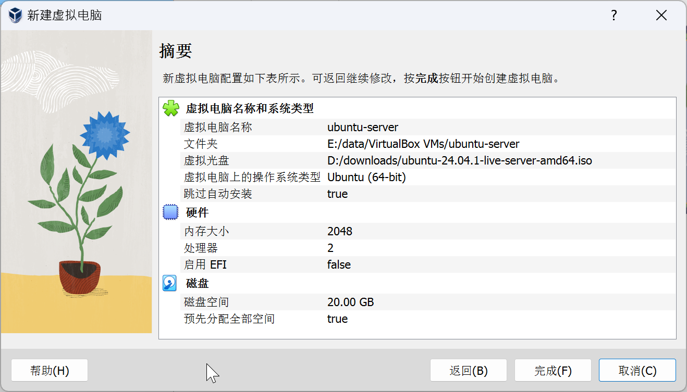
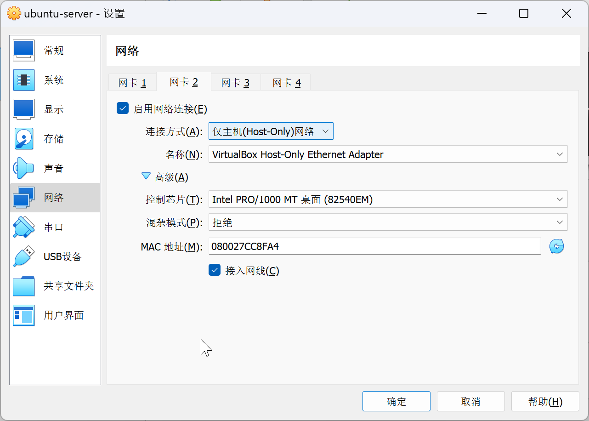
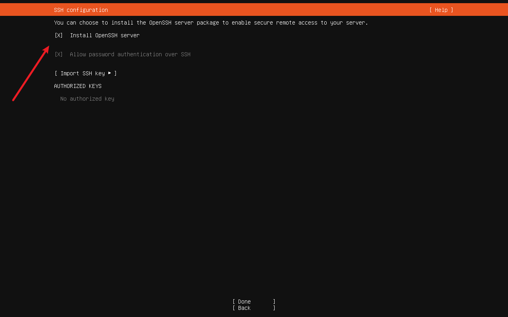

# Virtual Box

本文介绍如何使用 Virtual Box 安装 Ubuntu 24.04，并配置网络。目的如下：
1. 虚拟机能够通过主机访问外部网络, 外部网络无法访问虚拟机
2. 主机也能够访问虚拟机
4. 虚拟机使用固定的 IP 地址。

这样的配置适合搭建本地的开发环境，同时也兼具安全性。

## 准备工作

1. 下载 [Ubuntu 24.04 镜像](https://ubuntu.com/download/server/thank-you?version=24.04.1&architecture=amd64&lts=true)
2. 下载 [Virtual Box 7.0.14 安装包](https://download.virtualbox.org/virtualbox/7.0.14/VirtualBox-7.0.14-161095-Win.exe)

## Virtual Box 安装

首先版本选择很重要，从 `7.0.16` 开始，只能安装在管理员或系统账户具有权限的路径，因此我们选择安装 `7.0.14` 版本。

Virtual Box 还依赖 Python 3.x，因此你还需要额外安装 Python，并且安装以下依赖包：

```bash
pip install pywin32
```

对于其他选项，一路选择默认配置即可。

## 查看网卡配置

安装完成后，我们先不急着创建虚拟机，而是先查看一下网络配置。

选择网络管理器，查看网卡配置。



可以看到 Virtual Box 默认配置了一个 `Host-Only Adapter`，这个适配器用于主机和虚拟机之间的通信。



其中关键信息为最小地址和最大地址，我们的虚拟机 IP 地址应该在这个范围内，即 `192.168.56.101` ~ `192.168.56.254`。

## 安装 Ubuntu

新建虚拟机，选择之前下载的 Ubuntu 24.04 镜像。勾选上`跳过自动安装`。



调整虚拟机的硬件配置，这里设置为 2 核 CPU 和 2G 内存。



调整虚拟机的硬盘配置，这里设置为 20G 硬盘，并勾选 `预先分配全部空间`，可提升存储性能。如果空间比较紧张，可以不勾选。



完整配置如图所示：



虚拟机创建完成后，先不着急启动，而是先配置网络。

在虚拟机的网络设置中，将第二个适配器设置为 `仅主机(Host-Only)网络`。



展开高级设置，记录下 MAC 地址，之后有用。

| 适配器 | MAC 地址 |
| --- | --- |
| 仅主机(Host-Only)网络 | 080027CC8FA4 |

启动虚拟机，将 Ubuntu 安装到硬盘中。一路选择默认配置即可。唯一需要注意的是，勾选上 `Install OpenSSH server`，这样我们可以使用 SSH 连接到虚拟机。



安装完成后，选择 `Reboot Now` 重启虚拟机。

启动虚拟机，执行命令 `ip addr`，可以观察到如下输出：

```text{15,16}
1: lo: <LOOPBACK,UP,LOWER_UP> mtu 65536 qdisc noqueue state UNKNOWN group default qlen 1000
    link/loopback 00:00:00:00:00:00 brd 00:00:00:00:00:00
    inet 127.0.0.1/8 scope host lo
       valid_lft forever preferred_lft forever
    inet6 ::1/128 scope host noprefixroute
       valid_lft forever preferred_lft forever
2: enp0s3: <BROADCAST,MULTICAST,UP,LOWER_UP> mtu 1500 qdisc pfifo_fast state UP group default qlen 1000
    link/ether 08:00:27:82:61:36 brd ff:ff:ff:ff:ff:ff
    inet 10.0.2.15/24 metric 100 brd 10.0.2.255 scope global dynamic enp0s3
       valid_lft 86244sec preferred_lft 86244sec
    inet6 fe80::a00:27ff:fe82:6136/64 scope link
       valid_lft forever preferred_lft forever
3: enp0s8: <BROADCAST,MULTICAST,UP,LOWER_UP> mtu 1500 qdisc pfifo_fast state UP group default qlen 1000
    link/ether 08:00:27:cc:8f:a4 brd ff:ff:ff:ff:ff:ff
    inet 192.168.56.101/24 metric 100 brd 192.168.56.255 scope global dynamic enp0s8
       valid_lft 444sec preferred_lft 444sec
    inet6 fe80::a00:27ff:fecc:8fa4/64 scope link
       valid_lft forever preferred_lft forever
```

我们观察到第三个网卡 `enp0s8` 的 MAC 地址为 `08:00:27:cc:8f:a4`，与我们之前记录的 MAC 地址相同。
其中分配给虚拟机的 IP 地址为 `192.168.56.101`，我们可以通过这个地址访问虚拟机。由于虚拟机的窗口比较难用，之后的操作均通过 SSH 到这个地址进行。

## 配置固定 IP

我们可以通过 SSH 连接到虚拟机，执行以下命令，请将 `edward` 替换为你的用户名。

```bash
ssh edward@192.168.56.101
```

现在的问题是，虚拟机的 IP 地址是动态分配的，我们希望虚拟机的 IP 地址是固定的。

编辑文件 `/etc/netplan/00-installer-config.yaml`，填入以下内容，
其中 `enp0s8` 为 Host-Only Adapter 的网卡，此外还将 `192.168.56.101` 这个 IP 固定分配给虚拟机。

```yaml
network:
  version: 2
  ethernets:
    enp0s8:
      addresses:
        - 192.168.56.101/24
```

接下来我们应用这个配置：

```bash
sudo netplan apply
```

至此，我们已经完成了虚拟机的 IP 地址固定配置。之后重启虚拟机，IP 地址不会发生变化。

## 镜像地址配置

Ubuntu 24.04 镜像源地址配置发生变更。如果你查看 `/etc/apt/sources.list` 文件，会看到如下内容：

```text
# Ubuntu sources have moved to /etc/apt/sources.list.d/ubuntu.sources
```

你参照以下步骤来配置镜像源地址为阿里云镜像源。

首先备份原有的镜像源地址：

```bash
sudo cp /etc/apt/sources.list.d/ubuntu.sources /etc/apt/sources.list.d/ubuntu.sources.bak
```

然后编辑文件 `/etc/apt/sources.list.d/ubuntu.sources`，替换为以下内容：

```text
Types: deb deb-src
URIs: https://mirrors.aliyun.com/ubuntu/
Suites: noble noble-security noble-updates noble-proposed noble-backports
Components: main restricted universe multiverse
Signed-By: /usr/share/keyrings/ubuntu-archive-keyring.gpg
```

保存文件后，更新镜像源：

```bash
sudo apt update
```

## 扩容虚拟机硬盘

如果你跟我一样配置了 20 GB 的硬盘并选择默认 Ubuntu 的默认安装选项，那么会发现有 10 GB 的硬盘空间没有被使用。

运行 `sudo fdisk -l`，可以看到如下输出：

```text{15}
Disk /dev/sda: 20 GiB, 21474836480 bytes, 41943040 sectors
Disk model: VBOX HARDDISK
Units: sectors of 1 * 512 = 512 bytes
Sector size (logical/physical): 512 bytes / 512 bytes
I/O size (minimum/optimal): 512 bytes / 512 bytes
Disklabel type: gpt
Disk identifier: 50C27EC0-CDB1-48F5-95B8-6BE0447B204B

Device       Start      End  Sectors  Size Type
/dev/sda1     2048     4095     2048    1M BIOS boot
/dev/sda2     4096  3719167  3715072  1.8G Linux filesystem
/dev/sda3  3719168 41940991 38221824 18.2G Linux filesystem


Disk /dev/mapper/ubuntu--vg-ubuntu--lv: 10 GiB, 10737418240 bytes, 20971520 sectors
Units: sectors of 1 * 512 = 512 bytes
Sector size (logical/physical): 512 bytes / 512 bytes
I/O size (minimum/optimal): 512 bytes / 512 bytes
```

可以看到 `/dev/mapper/ubuntu--vg-ubuntu--lv` 分区只使用了 10 GB 的空间，我们可以将剩余的空间分配给这个分区。

使用以下的命令可以将剩余的空间分配给根分区：

```bash
sudo lvextend -l +100%FREE /dev/mapper/ubuntu--vg-ubuntu--lv
sudo resize2fs /dev/mapper/ubuntu--vg-ubuntu--lv
```

运行 `df -h` 可以看到根分区已经成功扩容：

```text{15}
Disk /dev/sda: 20 GiB, 21474836480 bytes, 41943040 sectors
Disk model: VBOX HARDDISK
Units: sectors of 1 * 512 = 512 bytes
Sector size (logical/physical): 512 bytes / 512 bytes
I/O size (minimum/optimal): 512 bytes / 512 bytes
Disklabel type: gpt
Disk identifier: 50C27EC0-CDB1-48F5-95B8-6BE0447B204B

Device       Start      End  Sectors  Size Type
/dev/sda1     2048     4095     2048    1M BIOS boot
/dev/sda2     4096  3719167  3715072  1.8G Linux filesystem
/dev/sda3  3719168 41940991 38221824 18.2G Linux filesystem


Disk /dev/mapper/ubuntu--vg-ubuntu--lv: 18.22 GiB, 19566428160 bytes, 38215680 sectors
Units: sectors of 1 * 512 = 512 bytes
Sector size (logical/physical): 512 bytes / 512 bytes
I/O size (minimum/optimal): 512 bytes / 512 bytes
```